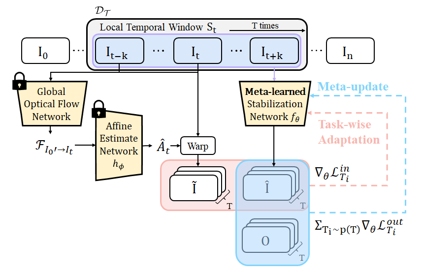

# Harnessing Meta-Learning for Enhanced Full-Frame Video Stabilization

Muhammad Kashif Ali, Eun Woo Im, Dongjin Kim, Tae Hyun Kim 

[[CVPR2024] Paper](https://openaccess.thecvf.com/content/CVPR2024/papers/Ali_Harnessing_Meta-Learning_for_Improving_Full-Frame_Video_Stabilization_CVPR_2024_paper.pdf)

>Video stabilization is a longstanding computer vision problem particularly pixel-level synthesis solutions for video stabilization which synthesize full frames add to the complexity of this task. These techniques aim to stabilize videos by synthesizing full frames while enhancing the stability of the considered video. This intensifies the complexity of the task due to the distinct mix of unique motion profiles and visual content present in each video sequence making robust generalization with fixed parameters difficult. In our study we introduce a novel approach to enhance the performance of pixel-level synthesis solutions for video stabilization by adapting these models to individual input video sequences. The proposed adaptation exploits low-level visual cues accessible during test-time to improve both the stability and quality of resulting videos. We highlight the efficacy of our methodology of" test-time adaptation" through simple fine-tuning of one of these models followed by significant stability gain via the integration of meta-learning techniques. Notably significant improvement is achieved with only a single adaptation step. The versatility of the proposed algorithm is demonstrated by consistently improving the performance of various pixel-level synthesis models for video stabilization in real-world scenarios.

## Table of Contents

- [Framework Overview](#framework-overview)
- [How to Run](#how-to-run)
  - [Installation](#installation)
  - [Training and Evaluation](#training-and-evaluation)
    - [Dataset](#dataset)
    - [Training](#training)
    - [Testing](#testing-on-videos)
- [Results](#results)
- [Citation](#citation)
- [Acknowledgements](#acknowledgements)

## Framework Overview

<p align="center">
  
</p>

## How to Run

### Installation

First, compile the dependencies for PWCNet from their official repository, as GlobalFlowNet uses a modified version of PWCNet. Then, run the following commands to clone the repository and set up the environment:

```bash
# Clone this repo
git clone https://github.com/MKashifAli/MetaVideoStab.git
cd MetaVideoStab

# Create and activate conda environment
conda env create -f environments.yaml
conda activate mvs
```

### Training and Evaluation

#### Dataset

To meta-train the different variants discussed in the paper (DMBVS, DMBVS_recurrent, or DIFRINT), download the DeepStab Dataset. Organize the files as shown below and update the corresponding directories in the code files:

```
root
└───unstable_frames
│   └───Video_1
│   │   │   xxxx.png
│   │   │   xxxx.png
│   │   └───...
│   └───Video_2
│   │   │   xxxx.png
│   │   │   xxxx.png
│   │   └───...
│   └───Video_3
│   │   │   xxxx.png
│   │   │   xxxx.png
│   │   └───...
└───stable_frames
│   └───Video_1
│   │   │   xxxx.png
│   │   │   xxxx.png
│   │   └───...
│   └───Video_2
│   │   │   xxxx.png
│   │   │   xxxx.png
│   │   └───...
│   └───Video_3
│   │   │   xxxx.png
│   │   │   xxxx.png
│   │   └───...
```

#### Training

Once the dataset is in place, you can begin meta-training the different variants by running the corresponding scripts as described in the table below:

| Variant          | Corresponding Code File        |
|------------------|--------------------------------|
| DMBVS            | train_DMBVS_vanilla.py         |
| DMBVS_recurrent  | train_DMBVS_recurrent.py       |
| DIFRINT          | train_DIF.py                   |

Please adjust the "opts" parameters in the respective files according to your data and resources before starting the training.

#### Testing on Videos

To perform test-time adaptation on your videos, download the [pretrained network checkpoints](https://drive.google.com/file/d/14oh0c6anUJHEkbG7TQJ2o4Gf9oCG4742/view?usp=sharing) and place them in the "pretrained_models" folder as shown below (or modify the paths in the `test_time_xxx.py` scripts accordingly):

```
root
└───pretrained_models
│   └───checkpoints              
│   │   └───dif_eval             # Meta-trained DIFRINT checkpoints 
│   │   │   └───xxx.pth
│   │   └───eval                 # Meta-trained DMBVS checkpoints
│   │   │   └───xxx.pth
│   │   └───rec_eval             # Meta-trained DMBVS_recurrent checkpoints
│   │   │   └───xxx.pth
│   └───CoarseStabilizer.pth
│   └───GFlowNet.pth
│   └───baseline_ckpts           # For performance comparison
```

Run the corresponding files as described in the table below to perform test-time adaptation for the different variants:

| Variant          | Corresponding Code File           |
|------------------|-----------------------------------|
| DMBVS            | test_time_adaptation_DMBVS.py     |
| DMBVS_recurrent  | test_time_adaptation_DMBVSr.py    |
| DIFRINT          | test_time_adaptation_DIF.py       |

## Results

[](https://www.youtube.com/watch?v=pUeT0mBxNLU)

### Citation

If you find our work useful in your research, please cite our publications:

```bibtex
@inproceedings{ali2024harnessing,
  title={Harnessing Meta-Learning for Improving Full-Frame Video Stabilization},
  author={Ali, Muhammad Kashif and Im, Eun Woo and Kim, Dongjin and Kim, Tae Hyun},
  booktitle={Proceedings of the IEEE/CVF Conference on Computer Vision and Pattern Recognition},
  pages={12605--12614},
  year={2024}
}


@article{ali2020deep,
  title={Deep motion blind video stabilization},
  author={Ali, Muhammad Kashif and Yu, Sangjoon and Kim, Tae Hyun},
  journal={arXiv preprint arXiv:2011.09697},
  year={2020}
}
```

## Acknowledgements

The code in this repository incorporates parts of some methods from [Learning Blind Video Temporal Consistency](https://github.com/phoenix104104/fast_blind_video_consistency) and [GlobalFlowNet](https://github.com/GlobalFlowNet/GlobalFlowNet). We thank the authors for sharing their code.


Additionally, to improve readability and cleaning the code, I have significantly rewritten and cleaned the original repository. If you encounter any bugs or issues, please report them, and I will address them as soon as I have enough time.
